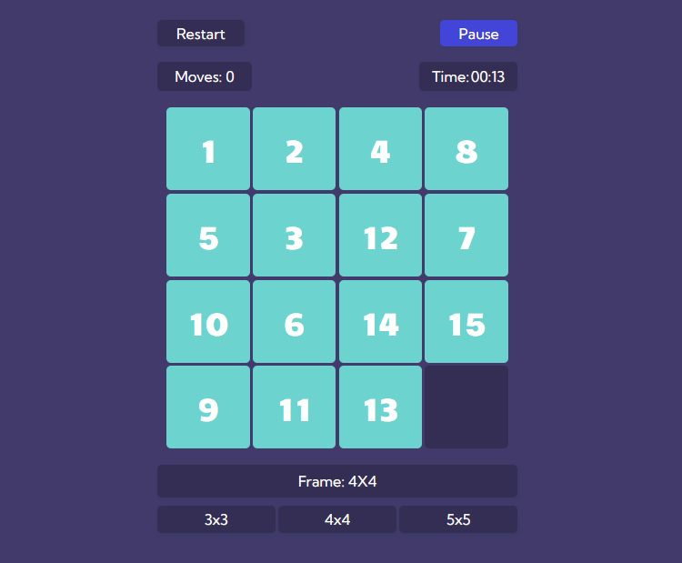

# 15 Puzzle

The 15 puzzle is a sliding puzzle with usually 15 square tiles numbered 1–15 in a 4x4 frame with one unoccupied position left.

[Play 15 Puzzle 🖐️](https://grinushka.github.io/fifteen-puzzle/)

### Screenshots

### Challenges faced and things learned during development

- Empty HTML file, all things get created in JS
- Desire to write as little code as possible and still have all the features available
- Keep field with cells of the same size, no matter how big the frame is

### Features

- Responsive design
- 3 different frame sizes
- Opportunity to pause the game
- Timer and moves counter

## Acknowledgments

- Pretty puzzle icon from [Icons8](https://icons8.com/)

## Badges

&nbsp;

&nbsp;
